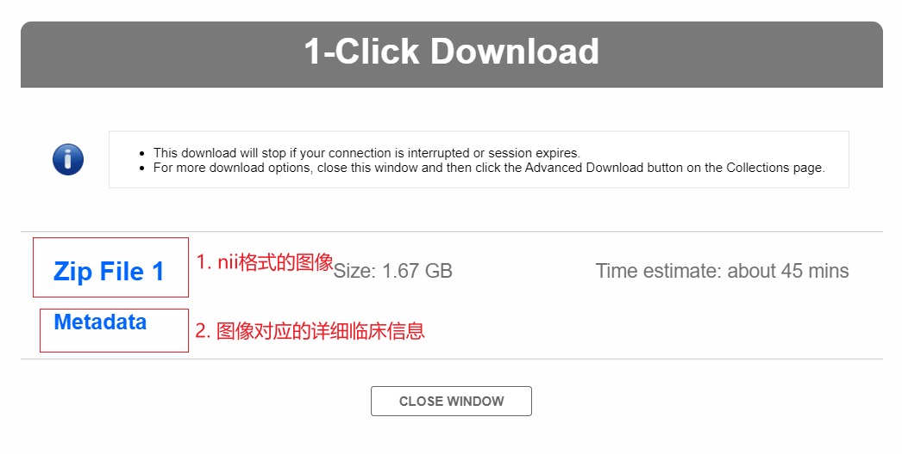

[TOC]


## 数据集下载

### 0 概览


- **search：**初级搜索
- **Advanced Search：**高级搜索，提供更多筛选参数
- **Data Collections**：
  - 数据收集处，可在筛选的时候将影像图片添加到指定文件夹中
  - 筛选完后在此处统一打包下载（csv，zip，）
  - 可选择社区提供的Public Collections（以便统一标准横向比较？）


### 1 筛选数据集

#### 1.1 自定义筛选 - Advanced Search


#### 1.2 ADNI共享数据集 - Data Collection


数据的采集时间：1Yr，2Yr...

扫描场强：1.5T，3T...


### 2 下载数据集

筛选完数据之后，就可进入Data Collection页面下载数据

**可供下载的数据如下：**

- csv：图像对应的标签，csv格式
- Metadata：图像对应的详细**临床**信息，xml格式，可用程序提取有用的信息加入到csv标签中
- Zip File：打包后的MRI扫描图像，nii格式


其中两种下载数据方式区别如下：

- 1-CLICK：一键下载
- ADVANCED：分压缩包下载




## 数据初步处理

### 可视化处理

```python
import nibabel as nib
import matplotlib.pyplot as plt
import numpy as np


img_path = r'Your nii path'

image_data = nib.load(img_path).get_fdata() 
x, y, z = image_data.shape   # 获取三个维度上的长度

for _ in range(x):   # 自定义横截面打印
    print(_)
    plt.imshow(image_data[_, :, :], cmap='gray')
    plt.show()
```


### 数据加载

```python
import nibabel as nib

img_path = r'D:\2020SIT1\2020Autumn\ADNI_dataset\ADNI1_Annual_2_Yr_3T\ADNI\002_S_1261\MPR____N3__Scaled\2008-05-27_18_41_16.0\S60591\ADNI_002_S_1261_MR_MPR____N3__Scaled_Br_20081224110926692_S60591_I132220.nii'

image = nib.load(img_path)
print(image)
```


### 数据预处理

转换图像类型，图像分割（ROI区域），像素归一化处理，高斯滤波，平滑处理......

详见参考链接


**参考链接**


[ADNI术语汇总]: https://blog.csdn.net/Houchaoqun_XMU/article/details/83617747?utm_medium=distribute.pc_relevant.none-task-blog-BlogCommendFromBaidu-5.control&amp;depth_1-utm_source=distribute.pc_relevant.none-task-blog-BlogCommendFromBaidu-5.control
[ADNI数据集下载]: https://blog.csdn.net/taylent/article/details/106854055?utm_medium=distribute.pc_relevant.none-task-blog-title-3&amp;spm=1001.2101.3001.4242
[ADNI数据预处理]: https://blog.csdn.net/houchaoqun_xmu/article/details/79679288?utm_medium=distribute.pc_relevant.none-task-blog-title-2&amp;spm=1001.2101.3001.4242
[SimpleITK库 - 医学图像处理]: https://blog.csdn.net/jancis/article/details/105580486
[读取nii]: https://www.cnblogs.com/dyc99/p/12539365.html

